# React Chat App

## Introduction

Creating the frontend for a Realtime Chat Application. It is built using ReactJS, Firebase.

 

## 🔗 Important Links

> ## Checkout the Website [Web Application]()
>
> ## Checkout the Application Demo Video [YouTube]()

 

## Features

- **Register**

User can able to create an account using his details using as displayName, email, password, displayAvatar in a Chat Application.

- **Login**

User can able to login if the user already have an account in the Chat Application. The credentials user needs enter in order to verify user is username and password.

- **Search**

User can able to search the conversations by contact name of his friends.

- **List of all Conversation**

The left panel of Chat Application will show list of all the conversation user has made earlier.  
Each conversation consist of contact name and some text of the last Message in the chat.

- **Create Conversation**

User can able to create a conversation. 
On Clicking the contact will start a new conversation(if no conversation was previously started). Or it will open the existing conversation for that contact.

- **Sending Messages**

User can able to send a message in the conversation. The message sent by user while communicating can be either in the form of text message, Emojis, images or combination of all.

- **Display Conversation**

It will display the current selected conversation messages.  
It will display all the existing conversation messages between the users.

- **Display Alerts/Notifications**

In order to know the status of action taken by user in Chat Application will be displayed using appropriate Alert/Notifications. This is done using react-toastify notification package in react.

- **Logout**

User can able to sign out from the Chat Application by clicking upon logOut button.

## Tools Used

## Library Used

- react
- firebase
- react-firebase-hooks
- react-icons
- react-input-emoji
- react-toastify
- react-router-dom
- sass
- uuid
- dotenv
- gh-pages

# Getting Started with Create React App

This project was bootstrapped with [Create React App](https://github.com/facebook/create-react-app).

## Available Scripts

In the project directory, you can run:

### `npm start`

Runs the app in the development mode.\
Open [http://localhost:3000](http://localhost:3000) to view it in your browser.

The page will reload when you make changes.\
You may also see any lint errors in the console.

### `npm test`

Launches the test runner in the interactive watch mode.\
See the section about [running tests](https://facebook.github.io/create-react-app/docs/running-tests) for more information.

### `npm run build`

Builds the app for production to the `build` folder.\
It correctly bundles React in production mode and optimizes the build for the best performance.

The build is minified and the filenames include the hashes.\
Your app is ready to be deployed!

See the section about [deployment](https://facebook.github.io/create-react-app/docs/deployment) for more information.

### `npm run eject`

**Note: this is a one-way operation. Once you `eject`, you can't go back!**

If you aren't satisfied with the build tool and configuration choices, you can `eject` at any time. This command will remove the single build dependency from your project.

Instead, it will copy all the configuration files and the transitive dependencies (webpack, Babel, ESLint, etc) right into your project so you have full control over them. All of the commands except `eject` will still work, but they will point to the copied scripts so you can tweak them. At this point you're on your own.

You don't have to ever use `eject`. The curated feature set is suitable for small and middle deployments, and you shouldn't feel obligated to use this feature. However we understand that this tool wouldn't be useful if you couldn't customize it when you are ready for it.

## Learn More

You can learn more in the [Create React App documentation](https://facebook.github.io/create-react-app/docs/getting-started).

To learn React, check out the [React documentation](https://reactjs.org/).

### Code Splitting

This section has moved here: [https://facebook.github.io/create-react-app/docs/code-splitting](https://facebook.github.io/create-react-app/docs/code-splitting)

### Analyzing the Bundle Size

This section has moved here: [https://facebook.github.io/create-react-app/docs/analyzing-the-bundle-size](https://facebook.github.io/create-react-app/docs/analyzing-the-bundle-size)

### Making a Progressive Web App

This section has moved here: [https://facebook.github.io/create-react-app/docs/making-a-progressive-web-app](https://facebook.github.io/create-react-app/docs/making-a-progressive-web-app)

### Advanced Configuration

This section has moved here: [https://facebook.github.io/create-react-app/docs/advanced-configuration](https://facebook.github.io/create-react-app/docs/advanced-configuration)

### Deployment

This section has moved here: [https://facebook.github.io/create-react-app/docs/deployment](https://facebook.github.io/create-react-app/docs/deployment)

### `npm run build` fails to minify

This section has moved here: [https://facebook.github.io/create-react-app/docs/troubleshooting#npm-run-build-fails-to-minify](https://facebook.github.io/create-react-app/docs/troubleshooting#npm-run-build-fails-to-minify)

## Screens

### Register Page:

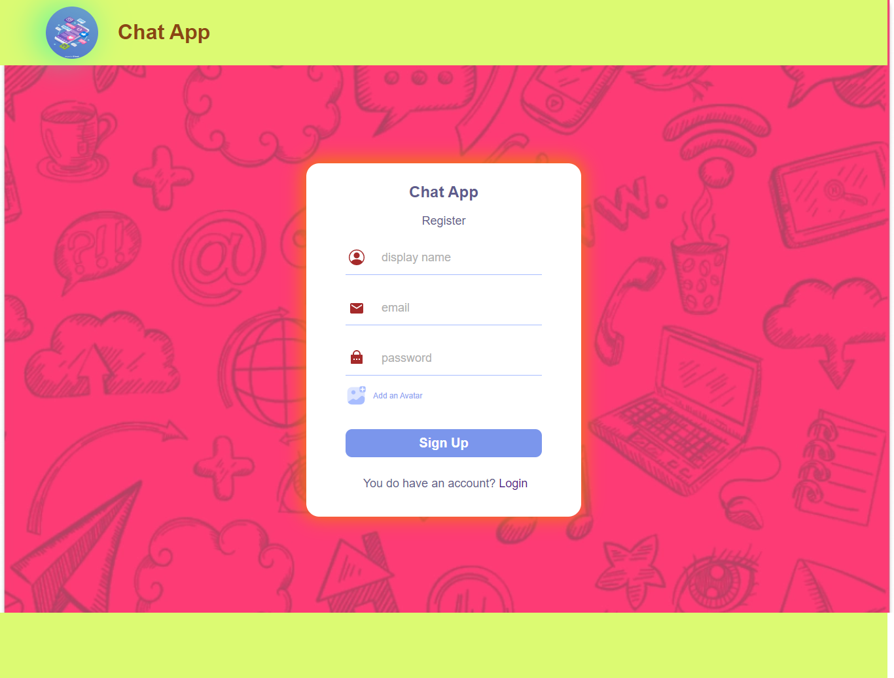
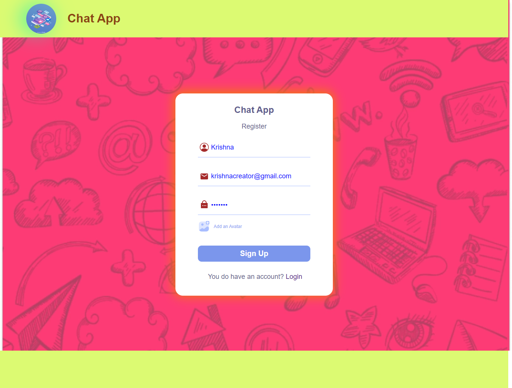
   
### Login Page:    
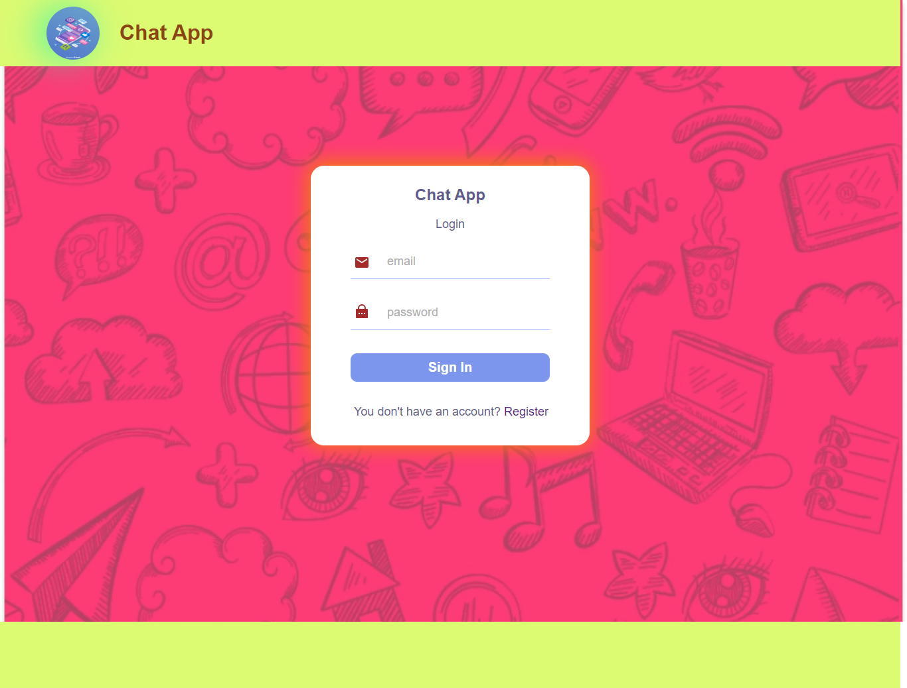
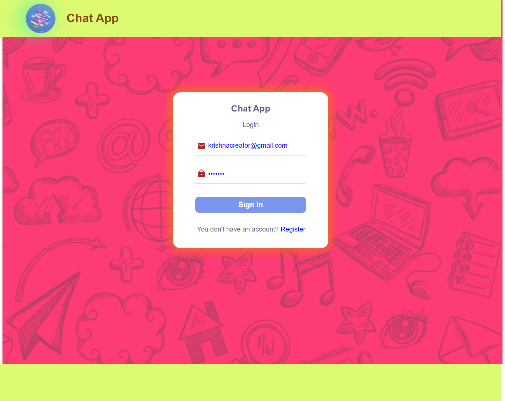

### Home Page:

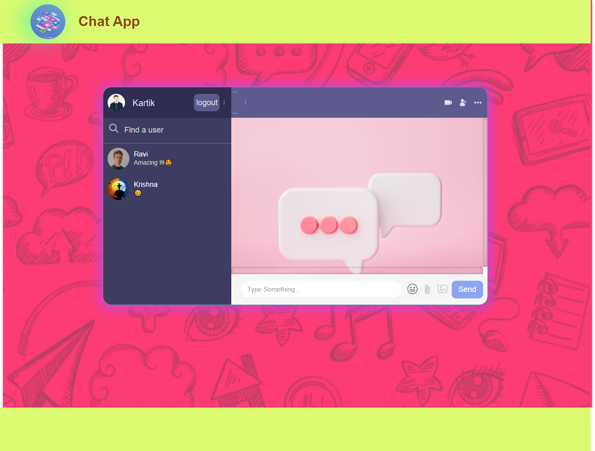
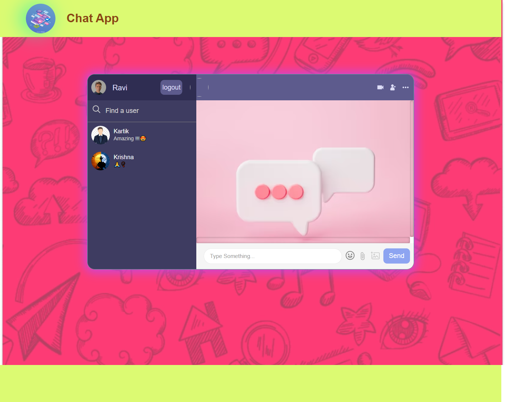

### Chat Conversations:

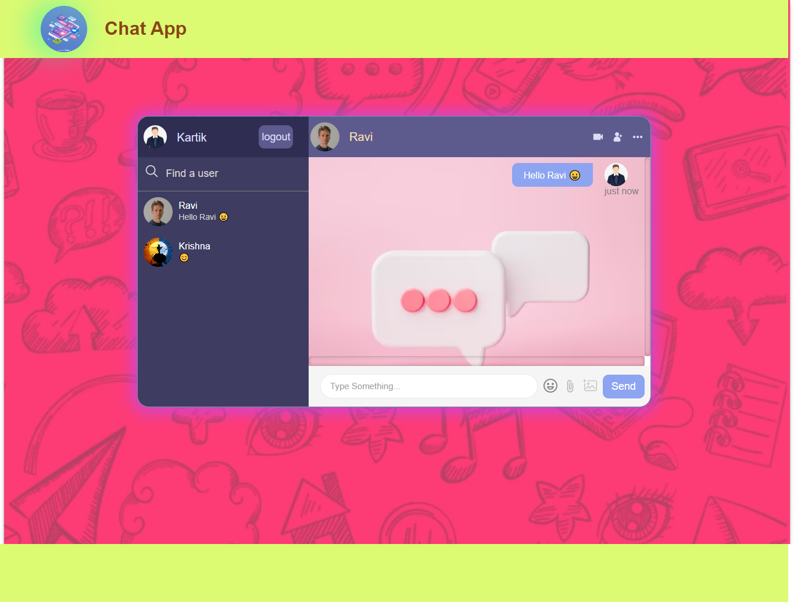
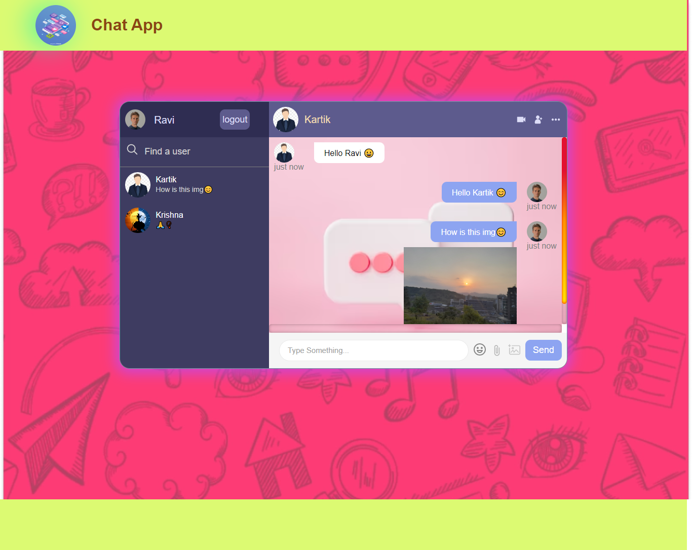
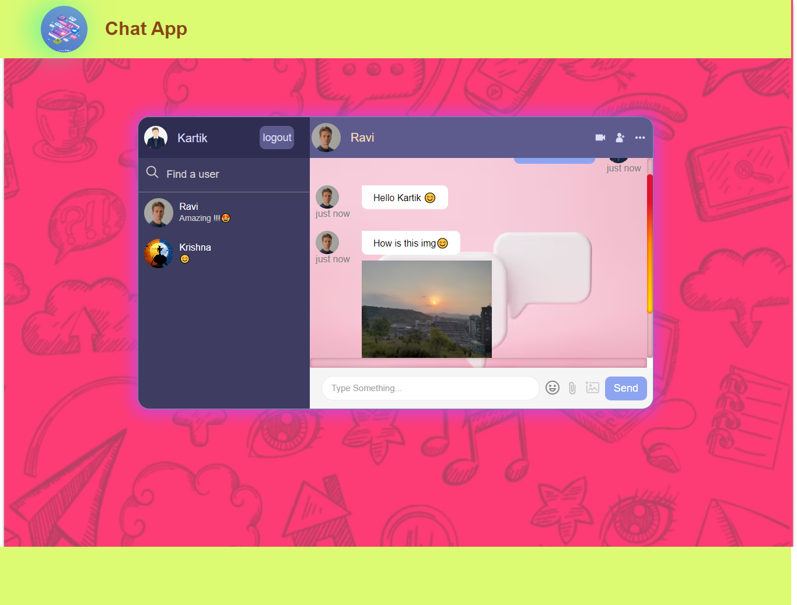
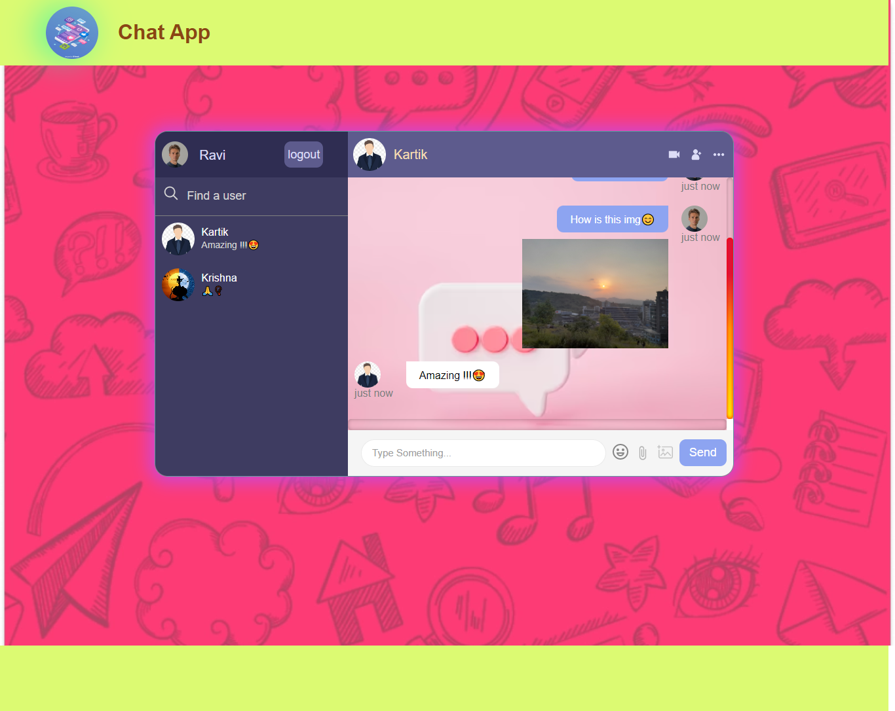

### Searching Conversation by Contact Name:

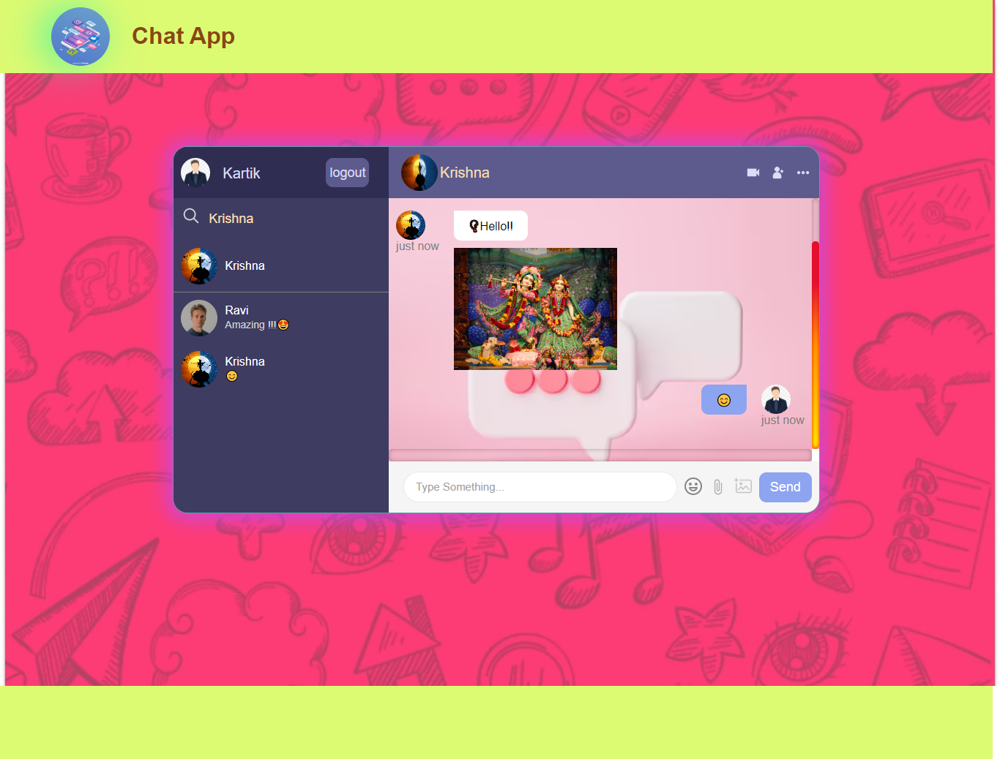

 
